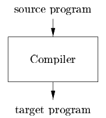
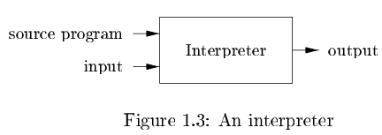
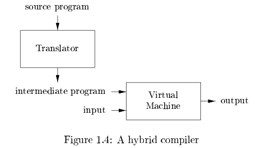
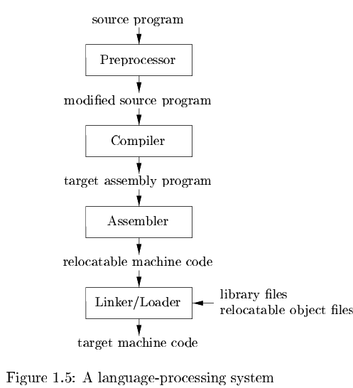
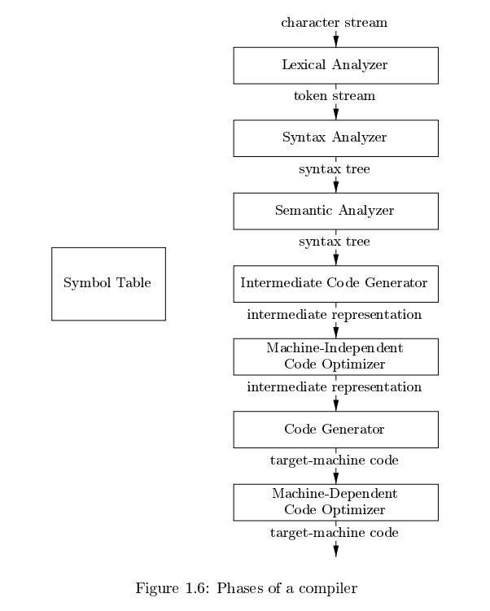
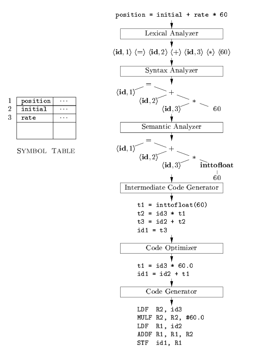

## **Introduction**
The translation is done by **compilers**, which are specialized software systems.
Compiler design involves concepts from:

* **Programming languages**
* **Machine architecture**
* **Language theory**
* **Algorithms**
* **Software engineering**

# **1.1 Language Processors**
A **language processor** is any system that processes programs written in a programming language.
The most common types are **compilers** and **interpreters**.

|Definition|Diagram|
|----------|-------|
|**1. Compiler**: Reads a program in one language (**source language**).<br> Translates it into an **equivalent program** in another language (**target language**).<br> Reports any **errors** found during translation. ||
| **2. Interpreter**:<br> Executes the source program **directly**, line by line, without producing a separate target program.<br> Performs the actions described by the source program immediately.||
|**3. Hybrid Approach**:<br> Java uses a combination of compilation and interpretation: <br> 1. **Compiler** translates the Java source code into **bytecode** (intermediate form).<br>2. **Interpreter (JVM)** executes the bytecode on any machine. <br> This makes Java **platform-independent**.<br> A **Just-In-Time (JIT) compiler** can further optimize performance by translating bytecodes to machine code **at runtime**.||

**Comparison:**

* Compiled code runs **faster** than interpreted code.
* Interpreters provide **better error messages** because they execute code step-by-step.

**4. Additional Tools in Compilation**
|  |  |
|--|--|
||Creating an executable program may involve several tools working together: <br> 1. **Preprocessor**: performs several tasks before compilation: <br> - Combining source files into one complete program. <br> - Expanding macros (short shorthand notations) into full source language statements. <br> The result is a modified source program, which is then passed to the compiler. <br> 2. **Compiler**: Converts high-level source code to **assembly language** or **object code**. <br> 3. **Assembler**: <br> - Translates assembly code into **machine code (object files)**. <br> - This code is not yet ready to execute but can be linked and loaded later.  <br>4. **Linker**: Large programs are often compiled in separate pieces. <br> - Combines multiple relocatable object files. <br>Includes library files if needed.<br> - Resolves external memory addresses. <br> 5. **Loader**: Loads the executable program into main memory, preparing it for execution by the CPU.

# 1.2 The Structure of a Compiler

A compiler maps a source program to a semantically equivalent target program through two main parts: 
**analysis** (front end) and **synthesis** (back end).

### Analysis (Front End)
- Breaks down the source program into constituent pieces.
- Imposes a grammatical structure.
- Creates an intermediate representation.
- Detects syntactic or semantic errors and provides informative messages.
- Collects and stores source program information in a **symbol table**.

### Synthesis (Back End)
- Constructs the target program from the intermediate representation and symbol table.

## Compilation Phases


- Operates as a sequence of phases transforming representations of the source program.
- Typical phases are shown in Figure 1.6 (e.g., lexical analysis, syntax analysis, semantic analysis, intermediate code generation, optimization, code generation).
- Phases may be grouped, and intermediate representations might not be explicit.
- The symbol table is used by all phases.

### Optimization
- Optional machine-independent optimization phase between front and back end.
- Transforms intermediate representation to improve the target program.
- One or both optimization phases may be absent.

## **1.2.1 Lexical Analysis**

**Lexical Analysis**, also called **Scanning**, is the **first phase** of a compiler.
It reads the source program **character by character** and groups them into **meaningful sequences** called **lexemes**.

Each lexeme is converted into a **token** of the form:

$
\langle \text{token-name; attribute-value} \rangle
$

* **token-name:** Abstract symbol used in syntax analysis.
* **attribute-value:** Points to an entry in the **symbol table** containing details like name, type, or value.

---

### **Example**

For the statement:

```
position = initial + rate * 60
```

The lexical analyzer groups and maps each lexeme as follows:

| **Lexeme** | **Token** | **Description** |
| ---------- | --------- | --------------- |
| `position` | ⟨id, 1⟩   | Identifier (points to symbol table entry #1) |
| `=`        | ⟨=⟩       | Assignment operator    |
| `initial`  | ⟨id, 2⟩   | Identifier (entry #2)  |
| `+`        | ⟨+⟩       | Addition operator      |
| `rate`     | ⟨id, 3⟩   | Identifier (entry #3)  |
| `*`        | ⟨*⟩       | Multiplication operator|
| `60`       | ⟨60⟩      | Numeric constant|

---

### **Output Token Sequence**

After lexical analysis, the statement is represented as:

$$
⟨id,1⟩ ⟨=⟩ ⟨id,2⟩ ⟨+⟩ ⟨id,3⟩ ⟨*⟩ ⟨60⟩
$$

**Notes:**

* **Blanks** are ignored by the lexical analyzer.
* The **symbol table** stores information for identifiers and constants.
* The resulting tokens are passed to the **Syntax Analysis** phase for grammatical checking.


## **1.2.2 Syntax Analysis**

**Syntax Analysis**, also called **Parsing**, is the **second phase** of a compiler.
It uses the **tokens** generated by the lexical analyzer to form a **tree-like structure** that represents the **grammatical structure** of the program.


#### **Purpose**

* To check whether the sequence of tokens **follows the grammatical rules** of the programming language.
* To produce a **Syntax Tree** (or **Parse Tree**) that shows the **hierarchical structure** of operations.

* Ensures the program is **syntactically correct** (follows language grammar).
* Produces a **Syntax Tree** used by later phases for **semantic analysis** and **code generation**.
* Parsing is typically implemented using **Context-Free Grammars (CFGs)** and **syntax-directed translation** methods.
---

### **Example**

For the statement:

$$
position = initial + rate * 60
$$

The **parser** creates the following structure:

```
        =
      /   \
 position    +
           /   \
     initial     *
               /   \
            rate    60
```

* The node `*` indicates **multiplication** (performed first because of higher precedence).
* The node `+` adds the result of `rate * 60` to `initial`.
* The root node `=` assigns the final value to `position`.



## 1.2.3 Semantic Analysis 
The semantic analysis phase uses the syntax tree (from syntax analysis) and symbol table information to verify the source program's semantic consistency with the language definition. It collects and stores type information in the syntax tree or symbol table for use in intermediate code generation.

### Key Components
- **Type Checking**: Ensures operators have compatible operands.
  - Example: Array indices must be integers; using a floating-point number triggers an error.

### Type Conversions (Coercions)
- Languages may allow automatic conversions for compatibility.
  - Example: A binary arithmetic operator (e.g., `*`) can apply to integers or floating-point numbers.
  - If mixed (e.g., floating-point and integer), the compiler may coerce the integer to a floating-point number.

#### Example from Figure 1.7
- Assume `position`, `initial`, and `rate` are floating-point; `60` is an integer.
- For `rate * 60`, the semantic analyzer detects the type mismatch and inserts a conversion node (e.g., `inttofloat`) to convert `60` to floating-point.
- This results in an updated syntax tree with the explicit conversion.


## 1.2.4 Intermediate Code Generation

During translation from source to target code, compilers may create one or more intermediate representations. Syntax trees are a common form used in syntax and semantic analysis. After these phases, many compilers produce a low-level, machine-like intermediate representation resembling a program for an abstract machine.

### Properties of Intermediate Representation
- Easy to produce from the source program.
- Easy to translate into target machine code.

### Three-Address Code
- Discussed in Chapter 6.
- Consists of assembly-like instructions with up to three operands per instruction (each operand acts like a register).
- Key features:
  - At most one operator on the right side per assignment instruction.
  - Fixes the order of operations (e.g., multiplication before addition).
  - Generates temporary names (e.g., `t1`, `t2`) to hold computed values.
  - Some instructions may have fewer than three operands.

### Example
For the source: `position = initial + rate * 60` (assuming type conversion from earlier phases):

$$
t1 = inttofloat(60) \\
t2 = id3 * t1 \\
t3 = id2 + t2 \\
id1 = t3
$$

- `id1`, `id2`, `id3` represent `position`, `initial`, `rate` (from symbol table).

## 1.2.5 Code Optimization
The machine-independent code-optimization phase improves the intermediate code to produce better target code. "Better" typically means faster execution, but could also include shorter code or lower power consumption. A straightforward intermediate code generation followed by optimization is an effective approach for generating good target code.

### Optimization Process
- Deducts improvements like compile-time conversions (e.g., integer to floating-point).
- Eliminates redundant operations and reduces temporary variables.
- Varies by compiler: "Optimizing compilers" invest significant time here, while simpler optimizations can improve runtime without much compilation overhead.

### Example
From the previous intermediate code (1.3):
$$
t1 = inttofloat(60) \\
t2 = id3 * t1 \\
t3 = id2 + t2 \\
id1 = t3
$$

Optimized to (1.4):
$$
t1 = id3 * 60.0 \\
id1 = id2 + t1
$$

- Converts `60` to `60.0` at compile time, removing `inttofloat`.
- Eliminates `t3` by directly assigning to `id1`.

## 1.2.6 Code Generation

The code generation phase takes the intermediate representation of the source program and maps it to the target language (e.g., machine code). It involves:
- Selecting registers or memory locations for variables.
- Translating intermediate instructions into sequences of machine instructions that perform equivalent tasks.
- Key focus: Efficient register assignment for variables.

### Example
For the intermediate code (1.4):
$$
t1 = id3 * 60.0 \\
id1 = id2 + t1
$$
Translated to machine code using registers R1 and R2 (assuming floating-point operations):
```
LDF R2, id3      # Load id3 (rate) into R2
MULF R2, R2, #60.0  # Multiply R2 by 60.0 (immediate constant)
LDF R1, id2      # Load id2 (initial) into R1
ADDF R1, R1, R2  # Add R2 to R1
STF id1, R1      # Store R1 into id1 (position)
```

- Instructions deal with floating-point numbers (indicated by 'F').
- `#` denotes immediate constants.
- This implements the original assignment: `position = initial + rate * 60`.

#### Additional Notes
- Storage allocation for identifiers is a critical issue, depending on the language.
- Decisions on storage organization (run-time) are made during intermediate code generation or code generation.


## 1.2.7 Symbol-Table Management 
A key compiler function is recording variable names from the source program and collecting attributes such as storage allocation, type, scope (usage range), and for procedures: argument count/types, passing method (e.g., by value or reference), and return type.

### Symbol Table Structure
- Data structure with a record for each variable name.
- Fields store name attributes.
- Designed for quick lookup, storage, and retrieval of records.
- Discussed in detail in Chapter 2.

## 1.2.8 Grouping of Phases into Passes 
Phases represent the logical organization of a compiler. In implementation, multiple phases may combine into a **pass** that reads an input file and writes an output file.

### Example Grouping
- Front-end pass: Lexical analysis, syntax analysis, semantic analysis, and intermediate code generation.
- Optional: Code optimization pass.
- Back-end pass: Code generation for a specific target machine.

### Modular Compiler Design
- Some compiler systems use well-designed intermediate representations.
- Allows mixing front ends (for different languages) with back ends (for different machines).
- Enables creating compilers for multiple languages on one machine or one language on multiple machines by swapping components.

## 1.2.9 Compiler-Construction Tools
Compiler writers benefit from general software development tools (e.g., language editors, debuggers, version managers, profilers, test harnesses) and specialized tools for compiler phases. These tools use domain-specific languages and algorithms to generate components that integrate easily into the compiler, hiding implementation details.

### Commonly Used Tools
1. **Parser Generators**: Automatically create syntax analyzers from a grammatical description of the programming language.
2. **Scanner Generators**: Produce lexical analyzers from regular-expression descriptions of language tokens.
3. **Syntax-Directed Translation Engines**: Generate routines to traverse parse trees and produce intermediate code.
4. **Code-Generator Generators**: Create code generators from rules translating intermediate language operations to target machine language.
5. **Data-Flow Analysis Engines**: Collect information on value transmission across program parts; essential for code optimization.
6. **Compiler-Construction Toolkits**: Provide integrated routines for building various compiler phases.