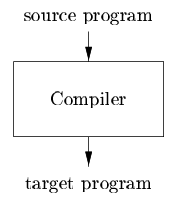
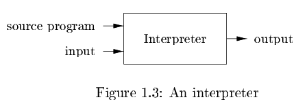
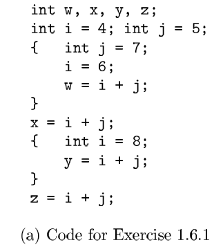
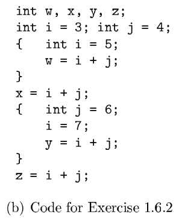
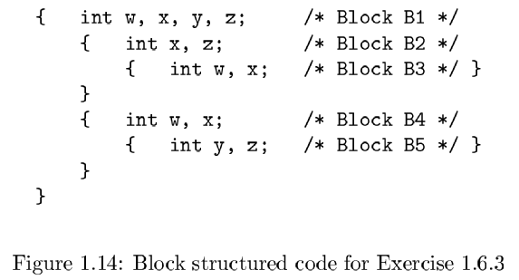

# Exercises for Section 1.1

* *Exercise 1.1.1*: What is the difference between a compiler and an interpreter?
    |Feature|Compiler|Interpreter|
    |----------|-------|----|
    |*Execution*|*compiler* translates the entire program from a high-level language into machine code before execution.| Translates and executes code line-by-line
    |*Output*| The output is typically an executable file, and the program can run independently once compiled.|Does not produce a separate file|
    |*Error Detection*|Detects errors during compilation.|Detects errors during execution.|
    |Diagram|| |

* *Exercise 1.1.2*: What are the advantages of

    (a) a compiler over an interpreter
    
    (b) an interpreter over a compiler?
            
    |Feature|Compiler|Interpreter|
    |-------|--------|-----------|
    |*Portability*| Less portable it's a machine-specific binaries| More portable it runs on any system with the interpreter.|
    |*Speed*|Faster at runtime (after compilation)|Slower, since it processes code during execution|
    |*Debugging*|Harder to debug (errors found all at once)|Easier to debug (errors found as code runs)|

*  *Exercise 1.1.3*: What advantages are there to a language-processing system, in which the compiler produces assembly language rather than machine language?
    - It's easier for the compiler to generate.
    - It's easier for humans to debug.

*  *Exercise 1.1.4*: A compiler that translates a high-level language into another high-level language is called a source-to-source translator. 
    
    What advantages are there to using C as a target language for a compiler?

    - C is supported on virtually every platform, so compiled code can run anywhere.    
    - C is readable and debuggable, making it easier to trace and fix issues.

*  *Exercise 1.1.5*: Describe some of the tasks that an assembler needs to perform.
    - Transelate Assembly uses symbolic names for CPU instructions.
    - Address and Label Resolution

# Exercises for Section 1.3

* *Exercise 1.3.1*: Indicate which of the following terms
    apply to which of the following languages
    * **Imperative:** C, C++, COBOL, Fortran, Java, Lisp, ML, Perl, Python, VB
    * **Declarative:** Lisp, ML
    * **Von Neumann:** 
    * **Object-Oriented:** C++, Java, Python, VB, (partly Perl)
    * **Functional:** Lisp, ML, (partly Python)
    * **Third Generation (3GL):** C, C++, COBOL, Fortran, Java, Lisp, ML, Perl, Python, VB
    * **Fourth Generation (4GL):** None strictly — though some VB or scripting dialects are sometimes seen as approaching 4GL
    * **Scripting:** Perl, Python, VBScript (subset of VB)

# Exercises for Section 1.6

* Exercise 1.6.1
    

    For the code in Fig. 1.13(a):
    - `w = 13`
    - `x = 11`
    - `y = 13`
    - `z = 11`

* Exercise 1.6.2
    
    
    For the code in Fig. 1.13(b):
        - `w = 9`
        - `x = 7`
        - `y = 13`
        - `z = 11`

* Exercise 1.6.3
    
    
    Scopes for each declaration in Fig. 1.14 (assuming static scoping):
    - Outer `w` (in B1): B1 excluding B3 and B4 (which includes B5)
    - Outer `x` (in B1): B1 excluding B2 (which includes B3) and B4 (which includes B5)
    - Outer `y` (in B1): B1 excluding B5
    - Outer `z` (in B1): B1 excluding B2 (which includes B3) and B5
    - `x` in B2: B2 excluding B3
    - `z` in B2: All of B2 (including B3)
    - `w` in B3: All of B3
    - `x` in B3: All of B3
    - `w` in B4: All of B4 (including B5)
    - `x` in B4: All of B4 (including B5)
    - `y` in B5: All of B5
    - `z` in B5: All of B5

* Exercise 1.6.4
```
 #define a (x+1)
 int x = 2;
 void b() { x = a; printf("%d\n", x); }
 void c() { int x = 1; printf("%d\n", a); }
 void main() { b(); c(); }
```
The code prints:
```
3
2
```
