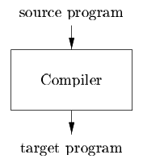

# Exercises for Section 1.1
* *Exercise 1.1.1*: What is the difference between a compiler and an interpreter?
    |Feature|Compiler|Interpreter|
    |----------|-------|----|
    |*Execution*|*compiler* translates the entire program from a high-level language into machine code before execution.| Translates and executes code line-by-line
    |*Output*| The output is typically an executable file, and the program can run independently once compiled.|Does not produce a separate file|
    |*Error Detection*|Detects errors during compilation.|Detects errors during execution.|
    |Diagram|| |

* *Exercise 1.1.2*: What are the advantages of

    (a) a compiler over an interpreter
    
    (b) an interpreter over a compiler?
            
    |Feature|Compiler|Interpreter|
    |-------|--------|-----------|
    |*Portability*| Less portable it's a machine-specific binaries| More portable it runs on any system with the interpreter.|
    |*Speed*|Faster at runtime (after compilation)|Slower, since it processes code during execution|
    |*Debugging*|Harder to debug (errors found all at once)|Easier to debug (errors found as code runs)|

*  *Exercise 1.1.3*: What advantages are there to a language-processing system, in which the compiler produces assembly language rather than machine language?
    - It's easier for the compiler to generate.
    - It's easier for humans to debug.

*  *Exercise 1.1.4*: A compiler that translates a high-level language into another high-level language is called a source-to-source translator. 
    
    What advantages are there to using C as a target language for a compiler?

    - C is supported on virtually every platform, so compiled code can run anywhere.    
    - C is readable and debuggable, making it easier to trace and fix issues.

*  *Exercise 1.1.5*: Describe some of the tasks that an assembler needs to perform.
    - Transelate Assembly uses symbolic names for CPU instructions.
    - Address and Label Resolution