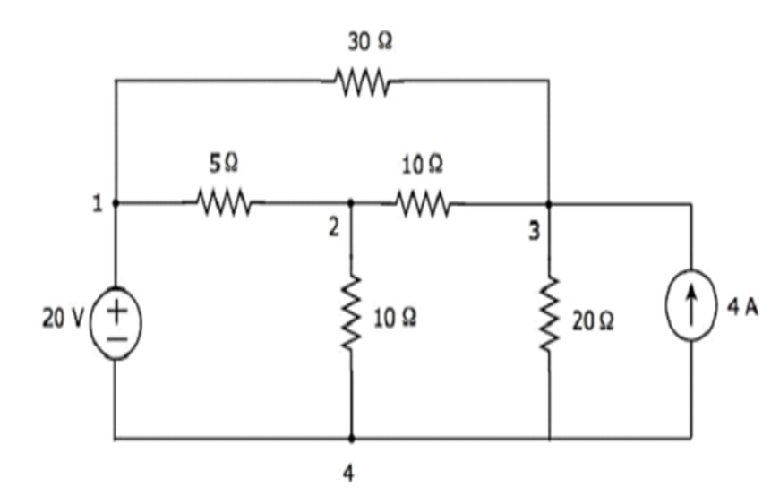
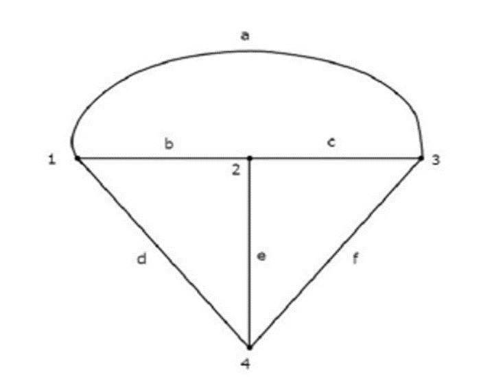
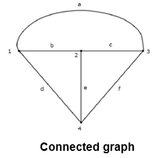
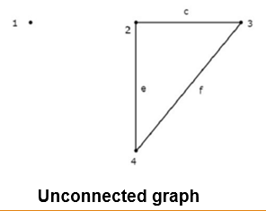
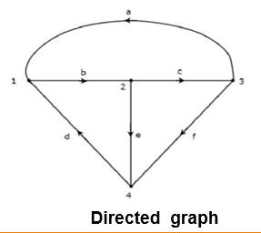
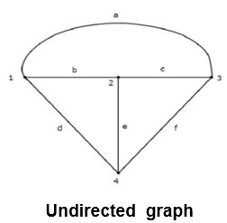
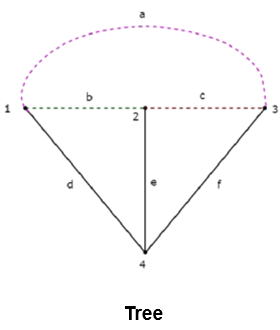
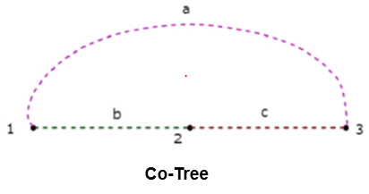
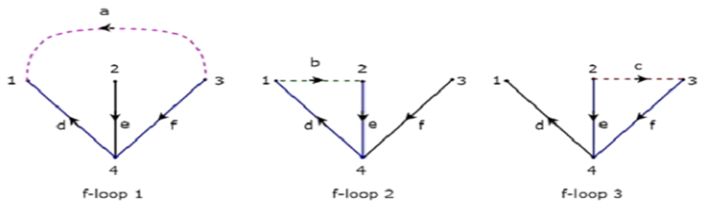
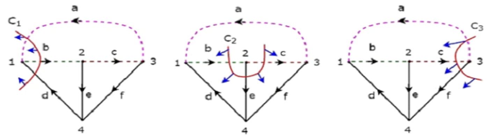

## What is CAD
CAD is a digital design tool that improves speed, accuracy, collaboration, and manufacturability of products.

* **Computer Aided Design**: is the use of *computer software and systems* to help engineers, architects, and designers in the *Creation, Modification, Analysis, and Optimization* of designs.
* **Main Purpose**
    * Increase productivity -> faster design process compared to manual drafting.
    * Improve Quality -> More accurate and precise designs.
    * Better Communication-> clear documentation and standerdization for teams.
    * Database Cearation -> Designs can be stored, retrived, and reused for manufacturing.
* **CAD Output**: Usually produced as electronic files that can be:
    * Printed as drawings.
    * Sent directly to machines (e.g., CNC machining, 3D printeres)
    * Used in simulations and analysis tools.

## CAD Fields
1. Electronic Design
    * known as Electronic Design Automation (EDA).
    * used for electronic circuits, printed circuit boards (PCBs), and integrated circuits (ICs).
    * Example tool: Cadence, Synopsys, Altium Designer.
2. Mechanical Design
    * known as Mechanical design automation(MDA).
    * used in mechanical engineering for parts, assemblies, and 3D modeling.
    * Example tools: AutoCAD Mechanical, SolidWorks, CATIA.

3. Architectural / Drafting
    * Known as Computer-Aided Drafting.
    * Focused on technical drawings, blueprints, and architectural layouts.
    * Example tools: AutoCAD, Revit, ArchiCAD.

## Graph Theory
* Graph theory is the graphical representation of electric circuits.
* It helps in analyzing complex electrical networks by converting them into network graphs that show the relationships between components.

### Purpose / Use
* Simplifies the analysis of complex circuits.
* Forms the foundation for techniques like:
* Mesh analysis
* Nodal analysis
* Network topology

### Components of a Graph
**Node (Vertex)**: A common connection point of two or more branches
* Represents a junction where circuit elements meet (e.g., a connection point in a circuit).
* *Note*: Sometimes, a node may have only a single branch connected to it.

**Branch**: A line segment connecting two nodes. Represents a circuit element such as a resistor, inductor, capacitor, voltage source, etc.

### Example
|   |   |
|---|---|
|||

* The circuit has 4 principal nodes → labeled 1, 2, 3, and 4.
* It has 7 branches, which include:
    * 1 branch with a voltage source
    * 1 branch with a current source
    * 5 branches with resistors

## Types of Graphs
Here’s a clean, well-structured explanation of the **Types of Graphs** in electrical network graph theory:

---

### **Types of Graphs**

#### **1. Connected and Unconnected Graphs**

|   |   |
|---|---|
|
* **Connected Graph:**

  A graph is **connected** if there exists **at least one path (branch)** between **every pair of nodes**.
  → In other words, you can travel from any node to any other node through the branches.

  * Example: All nodes in a simple circuit are linked through components.

* **Unconnected (Disconnected) Graph:**
  A graph is **unconnected** if **one or more nodes** are **isolated** that is, not connected to the rest of the graph by any branch.

  * Example: A circuit where a component or node is floating (not connected to the network).

---

#### **2. Directed and Undirected Graphs**

|   |   |
|---|---|
|
* **Directed Graph (Oriented Graph):**
  A graph is **directed** if **each branch has an arrow** showing the direction of current flow or voltage polarity.

  * Arrows represent **orientation** or **direction of energy transfer**.
  * Common in signal-flow graphs or current-direction analysis.

* **Undirected Graph (Unoriented Graph):**
  A graph is **undirected** if the **branches have no arrows**, meaning **no specific direction** is assigned.

  * Used when only **connectivity** matters, not current direction.

## **Subgraph and Its Types**

* **Subgraph:** is a part of a graph obtained by **removing some nodes and/or branches** from the original graph.

### **Types of Subgraphs**

There are **two main types** of subgraphs:

1. **Tree**
2. **Co-Tree**

#### **1. Tree**
|||
|-|-|
|A **Tree** is a **connected subgraph** that includes **all the nodes** of the original graph but **contains no loops**.

**Properties:**

* Contains **all nodes** of the graph.
* **Connected** (every node can be reached).
* **No loops** (acyclic).

**Terminology:**

* **Tree Branch:** Any branch that belongs to the tree.
* **Tree Link:** Any branch of the graph **not belonging to the tree**.

**Formulas:**
$$
\text{Number of Tree Branches} = N - 1
$$
$$
\text{Number of Tree Links} = B - (N - 1) = B - N + 1
$$

Where:

* **N** = number of nodes
* **B** = number of branches

#### **2. Co-Tree**
|||
|-|-|
|A **Co-Tree** is a subgraph formed by the **branches that were removed** while forming the Tree.   Hence, it is considered the **complement of the Tree**.

## **Network Topology Matrices**

**Matrices** play a key role in analyzing electrical networks because:

1. They **fully describe** the interconnections and reference directions of all branches.
2. They allow **Kirchhoff’s Current Law (KCL)** and **Kirchhoff’s Voltage Law (KVL)** to be expressed **easily and compactly**.
3. They are **well-suited for computer-based calculations** and circuit simulations.

---

### **Matrices Associated with Network Graphs**

In graph theory, **three main matrices** are used to represent and analyze network topology:

### 1. **Incidence Matrix**
  * **Definition:** An **Incidence Matrix** represents the connection between nodes and branches in an electric circuit or network.
  * **Purpose:** It shows how each branch is connected to different nodes and helps analyze or reconstruct the circuit’s graph.
  * **Structure:**

    * Rows → represent **nodes**.
    * Columns → represent **branches**.
  * **Elements of the matrix:**

    * **+1** → Branch current **leaves** the node.
    * **−1** → Branch current **enters** the node.
    * **0** → Branch is **not connected** to the node.
  * **Usage:**

    * Helps form circuit equations (KCL and KVL).
    * Useful in **network topology** and **computer-aided circuit analysis**.
    * Allows the **graph of the circuit** to be redrawn from the matrix.
  * **Example**

Consider the previous directed graph:

$$
A =
\begin{bmatrix}
-1 & 1 & 0 & -1 & 0 & 0 \\
0 & -1 & 1 & 0 & 1 & 0 \\
1 & 0 & -1 & 0 & 0 & -1 \\
0 & 0 & 0 & 1 & -1 & -1
\end{bmatrix}
$$

### 2. **Loop (Tie-Set) Matrix**
A **Loop (Tie-Set) Matrix** (often denoted as $B$) describes how **fundamental loops (f-loops)** relate to the branches in a network, including their orientation.

- **Rows:** Fundamental loops (one per link)
- **Columns:** Branches
- **Entries ($b_{ij}$):**
  - **+1:** Branch $j$ is in loop $i$ and directions agree
  - **−1:** Branch $j$ is in loop $i$ but directions are opposite
  - **0:** Branch $j$ is not in loop $i$

#### Example

Given branches (a, b, c, d, e, f) and three f-loops, the matrix:

$$
B =
\begin{bmatrix}
-1 & 0 & -1 & 1 & 0 & 0 \\
1 & 1 & 0 & 0 & 1 & 0 \\
0 & -1 & 1 & 0 & 0 & 1
\end{bmatrix}
$$

- Row 1: f-loop1, Row 2: f-loop2, Row 3: f-loop3
- Columns: a, b, c, d, e, f

### 3. **Cut-Set Matrix**

* A **fundamental cut-set** is a **minimal set of branches** whose removal **splits the graph into two disconnected subgraphs**.
* Each f-cut set contains **one link (twig)** plus one or more tree branches.
* The number of f-cut sets equals the number of **links** (twigs).
* The **cut-set matrix** encodes how branch voltages relate to twig (cut) voltages.

* **Rows** → individual **f-cut sets**.
* **Columns** → branches (one column per branch).
* Entries are in ({+1,-1,0}):

  * **+1** → the branch or link is in the cut-set and its chosen reference direction **agrees** with the cut (twig) reference.
  * **−1** → the branch or link is in the cut-set but its direction is **opposite** to the cut (twig) reference.
  * **0** → branch is **not part** of that cut-set.

Columns (assumed order) = branches (a,b,c,d,e,f).
Rows = f-cut1, f-cut2, f-cut3.

$$
C =
\begin{bmatrix}
1 & 0 & 0 & 1 & -1 & 0 \\
0 & 1 & 0 & 0 & -1 & 1 \\
0 & 0 & 1 & 1 & 0 & -1
\end{bmatrix}
$$

#### How it’s used

* The cut-set matrix is useful for writing **KCL-style** equations in cut form or for relating **branch voltages** to twig voltages when solving networks.
* Combined with element impedances it helps form linear equations for voltages/currents across the network.
* Cut-set and tie-set (loop) matrices are complementary: they reflect two dual ways to express network constraints (KCL/KVL). Rows of the cut-set matrix are orthogonal (in the graph-theory sense) to rows of a properly chosen loop/tie-set matrix.