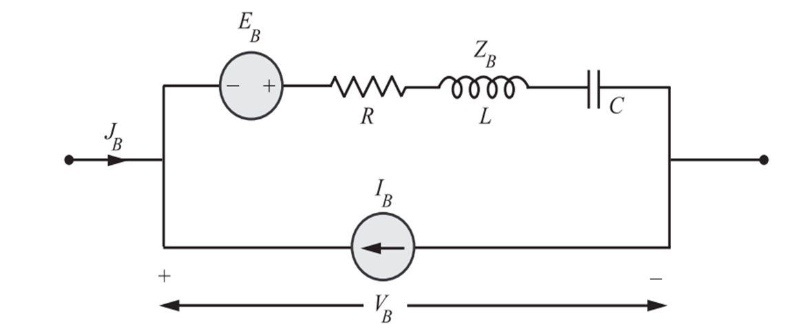

# Network Equilibrium Equations

## Notation (consistent)

- $B$ = number of branches.
- $b$ = number of fundamental loops (rows of tie-set matrix $B$).
- $n$ = number of cut-sets (rows of cut-set matrix $C$).
- $B$ (tie-set) = tie-set (loop) matrix, size $(b\times B)$.
- $C$ (cut-set) = cut-set matrix, size $(n\times B)$.
- $\mathbf{J}_B$ = $(B\times1)$ vector of **branch currents**.
- $\mathbf{V}_B$ = $(B\times1)$ vector of **branch voltages** (positive according to chosen branch reference).
- $\mathbf{I}_B$ = $(B\times1)$ vector of independent **current sources** in branches.
- $\mathbf{E}_B$ = $(B\times1)$ vector of independent **voltage sources** (branch emf).
- $Z_B$ = $(B\times B)$ **diagonal** branch impedance matrix.
- $\mathbf{I}_L$ = $(b\times 1)$ vector of **loop currents**.
- $\mathbf{V}_T$ = $(n\times1)$ vector of **node-pair / cut voltages** (tree twig voltages).

(Keep consistent chosen reference directions for branches and loops/cuts.)

## 1 Branch constitutive equation (per branch)

For each branch the voltage–current relation (including branch sources) is:
$$
\boxed{V_B = Z_B (J_B + I_B) - E_B}
$$
where ($V_B, J_B, I_B, E_B$) are the branch vectors.

 
### A  **Loop (Tie-Set) Formulation (KVL)**

#### 1. KVL

KVL for every fundamental loop (rows of $B$):
$$
\boxed{B V_B = \mathbf{0}}
$$

#### 2. Branch currents in terms of loop currents (loop transformation)

$$
\boxed{J_B = B^{T} I_L}
$$
(substitute into branch model).

#### 3. Substitute into branch relation and apply KVL

$\mathbf{V}_S \equiv \mathbf{E}_B$

Start: $\mathbf{V}_B = \mathbf{Z}_B(\mathbf{J}_B + \mathbf{I}_B) - \mathbf{E}_B$.

Apply $B \mathbf{V}_B = \mathbf{0}$:
$$
B\,\mathbf{Z}_B\,(\mathbf{J}_B + \mathbf{I}_B) - B\,\mathbf{E}_B = \mathbf{0}.
$$
Replace $\mathbf{J}_B = B^{T} \mathbf{I}_L$:
$$
B\,\mathbf{Z}_B\,B^{T}\mathbf{I}_L + B\,\mathbf{Z}_B\,\mathbf{I}_B - B\,\mathbf{E}_B = \mathbf{0}.
$$

Rearrange to isolate loop currents:
$$
\boxed{B Z_B B^{T} I_L = B E_B - B Z_B I_B}
$$
Or equivalently (define $\mathbf{V}_S \equiv E_B$, $\mathbf{I}_S \equiv I_B$):
$$
\boxed{B Z_B B^{T} I_L = B V_S - B Z_B I_S}
$$

#### 4. Solve

- Solve the $b\times b$ linear system for $I_L$.
- Recover branch currents: $\mathbf{J}_B = B^{T} I_L$.
- Recover branch voltages: $\mathbf{V}_B = Z_B(\mathbf{J}_B + I_B) - E_B$.

### B **Cut-Set (Node) Formulation (KCL)**

#### 1. KCL (cut-set form)

KCL on each cut (rows of $C$):
$$
\boxed{C J_B = \mathbf{0}}
$$

#### 2. Branch voltages in terms of cut/node voltages

Each column of $C$ relates branch voltage to node-pair (cut) voltages:
$$
\boxed{V_B = C^{T} V_T}
$$

#### 3. Branch current relation (Ohm + sources)

Per-branch:
$$
J_B = Y_B V_B + Y_B E_B - I_B.
$$
In matrix form:
$$
\boxed{J_B = Y_B V_B + Y_B E_B - I_B}
$$

#### 4. Substitute into KCL and use $V_B = C^{T} V_T$

Start: $C J_B = 0$. Substitute:
$$
C\big( Y_B V_B + Y_B E_B - I_B \big) = 0.
$$
Replace $V_B = C^{T} V_T$:
$$
C Y_B C^{T} V_T + C Y_B E_B - C I_B = \mathbf{0}.
$$

Rearrange:
$$
\boxed{C Y_B C^{T} V_T = C I_B - C Y_B E_B}
$$
Or with $\mathbf{I}_S$ and $\mathbf{V}_S$:
$$
\boxed{C Y_B C^{T} V_T = C I_S - C Y_B V_S}
$$

#### 5. Solve

- Solve the $n\times n$ linear system for $V_T$.
- Recover branch voltages: $V_B = C^{T} V_T$.
- Recover branch currents: $J_B = Y_B V_B + Y_B E_B - I_B$.

## Remarks / Dimensions & Practical points

- $B Z_B B^{T}$ is $b\times b$. Its invertibility depends on network topology (tree/links) and passive elements  in resistive linear networks this is OK.
- $C Y_B C^{T}$ is $n\times n$. For node equations, one row/column may be redundant (ground reference) use reduced cut-set matrix or ground one node.
- The two formulations are **dual**: loop (mesh) uses KVL and loop currents; cut-set (node) uses KCL and node/cut voltages. Choose the one with smaller dimension (fewer loops or fewer nodes) for efficiency.
- After solving either linear system, always compute $\mathbf{J}_B$ and $\mathbf{V}_B$ to get physical quantities.

## final forms

**Loop (mesh) system:**
$$
\boxed{B Z_B B^{T} I_L = B E_B - B Z_B I_B}
\quad\Rightarrow\quad
\mathbf{J}_B = B^{T} I_L,\quad \mathbf{V}_B = Z_B(\mathbf{J}_B + I_B) - E_B
$$

**Cut-set (node) system:**
$$
\boxed{C Y_B C^{T} V_T = C I_B - C Y_B E_B}
\quad\Rightarrow\quad
\mathbf{V}_B = C^{T} V_T,\quad \mathbf{J}_B = Y_B V_B + Y_B E_B - I_B
$$