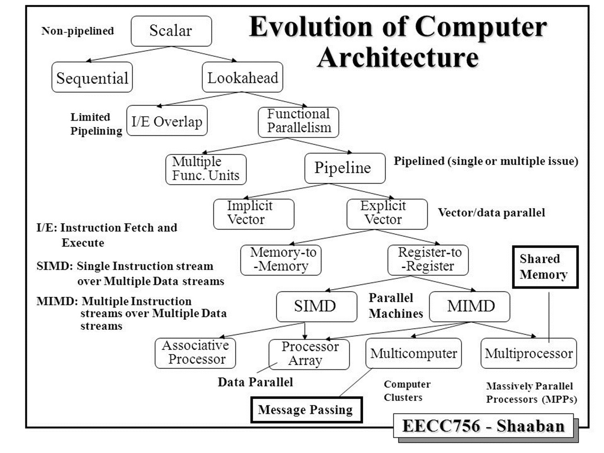
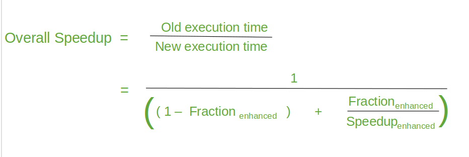

## Basic Terms

**Computer Archticture**: The conceptual design and operational structure of a computer system, includes the study of functional blocks that make up the computer system and the way they are connected.

 focusing on the instruction set architecture (ISA), data types, addressing modes, and programmer-visible features that define how software interacts with hardware.

**Computer Organisation**: the operational implementation of the architecture, deatailing hardware components like CPU datapaths, control units, memory hierarchy, registers, and interconnections that realize the architectural specifications effentiontly

**Computer Engineering**: referred to the actual construction of a computer.

## Von-Neumann Architecture

### main features:
* **Basic Components**: The computer consists of memory for storage, I/O devices for interaction, and CPU for computaion and control
* **Proplem-Independent Structure**: The hardware design remains fixed and versatile, capable of any computaional problem without architectural changes.
* **Binary Representation**: All data and instructions are encoded using binary signals (0s and 1s) for uniform processing.
* **Uniform Memory Cells**: Memory is organized into fixed-size units (bytes or woerds), each addressable and of equal capacity.
* **Shared Memory**: Instructions and Data are stored in the same memory
* **Sequential Program**: The program is a squence of instructions, executed in order control flow, with branching possible via jumps or conditions.

## Basic Microprocessor System
A standalone microprocessor is ineffective without supporting components like memory for storage and I/O ports for data exchange. Togther, they form a microprocessor-based system, where the microprocessor fetches and executes instrauctions form memory while handling data transfer via I/O.

* **Control Unit**: 
    * Central to a computer's operation.
    * overseeing all other components.
    * Managing data flow between components to execute computations.
    * Orchestrates the sequence of operations.
    * Directing units to perform tasks in a specific order synchronized by clock pulses.
* **ALU** (Arithmitic Logic Unit)
    * Serves as the core computational component, executing arithnetic functions like addition, subtraction, multiplication, and devision, as well as logical operations such as AND, OR, and NOT.
    * The control unit directs the ALU on which specific operation to perform and oversees the overall sequencing of instructions for orderly execution.
    * *Datapath* is characterized by registers that hold binary data and the operations applied to it.
* **Addresses**
    * *Address Bus:* unidirectional
        * Used to transmit the address of a memory location for read/write operations. 
        * Used to select specific input/output ports. 
        * It consists of 8, 12, 16, 20 or even more parallel lines
        * The number of bits (lines) determines the maximum addressable memory space, calculated as 2<sup>n</sup> bytes (e.g., a 16-bit bus can address  2 <sup> 16 </sup> = 65,536 bytes).
    * *Data Bus:* bidirectional
        * Used to transmit the data form/to CPU and peripherals.
        * Determine microprocessor's capacity is defined by its data bus width.
        * Sets the "word size" the number of bits processed as a single unit. (e.g., 4-bit, 8-bit, 16-bit)
        * Determines the maximum value the processor can handle directly. for example, a 16-bit bus supports up to 65,536 (64K).
    * *Control Bus:* varies  unidirectional and bidirectional
        * Transmit synchronizing signals and command signals to coordinate operations.
        * Directs control signals to memory, I/O ports, and peripherals for seamless functionality.
        * for example, to read memory location:
            1. The CPU sends the address via the address bus.
            2. The CPU sends the 
            "Memory Read" signal on the control bus.
            3. The memory then places the data on the data bus.
            
```
Time →            t0    t1    t2    t3    t4    t5

Clock             __|¯¯¯¯|__|¯¯¯¯|__|¯¯¯¯|__|¯¯¯¯|__|¯¯¯¯

Address Bus       -----------------Valid Address----------------

Control: ALE      ¯¯¯¯¯¯¯¯¯¯¯¯¯¯¯¯¯¯|___________________________
 (Address Latch Enable)

Control: RD       ________________________|¯¯¯¯¯¯¯¯¯¯¯¯¯¯¯¯¯¯¯¯¯
 (Read Enable, active low)

Data Bus          ----------------------------Valid Data-------

Memory Response   ---------------------------------Data Out----
```
## Evolution of Computer Architecture

1. Scalar/ Non-pipelined
    * The earlist computers executed one instructuction at a time in sequence (fetch → decode → execute)
    * No overlap between stages, each instruction must be fully completed before the next begins.
    * This limited performance since nuch of the CPU sat idle between operations.
2. Sequential → Lookahead
    * **Sequential**: Simple execution, strictly one-by-one instructions.
    * **Lookahead**: began predicting or prepareing for the next instruction before the current one finished, reducing idle time.
3. Instrauctions/Executions Overlap (I/E Overlap)
    * Introduced **Limited pipelining**.
    * Overlap between instruction fetch and execution to increase throughput.
    * Example: While one instruction executes, the next is already being fetched.
4. Functional Parallelism
    * Use of **multiple functional units** (like ALUs, FPUs)so that more than one operation could be carried out simultaneously.
    * Allowd **parallel execution** of independant tasks.
5. Pipeline Architecture
    * Divided instruction execution into multiple stages (Fetch → Decode → Execute).
    * Multiple instructions could be in different stages at once.
    * Types:
        * **Single Issue**: One instruction per cycle.
        * **Multiple Issue (Superscaler)**: Multiple instructions issued per cycle.
6. Vector Processing (Data Parallelism)
    * Focused on performing the same operation on larg sets of data simultaneously.
    * Two approches:
        * **Implicit Vector**: The hardware automatically vectorized operations.
        * **Explicit Vector**: Programmer/Compiler explicitly used vector instructions.
    * Two forms:
        * **Memory-to-Memory**: Operations directly between memory locations.
        * **Rigester-to-Register**: Data first loaded into registers, then operated upon.
7. SIMD (Single Instruction, Multiple Data)
    * A single instructions controls *multiple processing elements*.
    * Implemented in **processor arrays** or **Vector machines**.
    * Foundation of modern GPUs.
    * Example: Applying the same arithmitc operation on large arrays in parallel.
8. MIMD (Multiple Instruction, Multiple Data)
    * Different processors execute **different instructions on different data** at the same time. 
    * Different types:
        * Multicomputer (Clusters): Multiple independant systems connected via networks (message passing).
        * Multiprocessor (Shared Memory): Multiple CPUs shared memory sapce.
        * Massively Parallel processors(MPPs): Large-scale systems with thousands of processors working together.
9. Shared Memory vs. Massage Passing
    * **Shared Memory**: Processors access memory pool → simple communication but harder to scale.
    * **Message Passing**: Processors communicate explicitly via messags → scalable, used in distributed systems.

## Task of computer Designer
* Computer designers identify essential attributes for new systems and architect them to optimize performance and energy efficiency, while respecting constraints in cost, power, and availability.
* This role spans multiple facets: 
    * instruction set architecture (ISA) design
    * functional organization (e.g., datapaths, control units)
    * logic design (gates and circuits)
    * implementation including integrated circuit (IC) fabrication
    * packaging, power supply, and cooling.
* Effective optimization requires interdisciplinary knowledge, from software (compilers, operating systems) to hardware (logic design, packaging technologies).

## Boynod The Computer
* While personal computers (PCs) have significant impact, they represent only part of computing's role in the world.
* More ubiquitous are smaller
    *  single-chip systems like microcomputers or microcontrollers. 
    *  specialized digital signal processors (DSPs).
* These embedded systems integrate into everyday devices, powering appliances, vehicles, medical equipment, and IoT gadgets for seamless, task-specific functionality.

## Classes of Parallelism and Parallel Architectures
* Parallelism drives modern computer design across the four classes of (computers personal devices, servers, supercomputers, and embedded systems—with) energy efficiency and cost as key constraints.
* It manifests in forms like:
    * lookahead (prefetching instructions)
    * pipelining (overlapping instruction stages)
    * multitasking/multiprogramming (running multiple programs)
    * concurrency (simultaneous execution)
    * multithreading (multiple threads per process).
* Applications exhibit two primary parallelism types:
    * **Data-Level Parallelism (DLP)**: Operates on multiple data items simultaneously, ideal for array or matrix computations.
    * **Task-Level Parallelism (TLP)**: Involves independent tasks executing in parallel, suitable for divide-and-conquer or workflow scenarios.

## Michael Flynn's Classifications (Flunn's Taxonomy)

* Proposed in 1966 by Michael Flynn, this foundational framework 
* categorizes computer architectures based on the concurrency of instruction streams (how instructions are executed) and data streams (how data is processed). 
* It divides systems into four categories, highlighting levels of parallelism to improve performance beyond sequential processing.
* This taxonomy remains influential in understanding modern parallel computing, from CPUs to supercomputers.


Single Program, Multiple Data (SPMD) * Multiple Program, Multiple Data (MPMD);

1. **SISD (Single Instruction Stream, Single Data Stream)**
    
    * **Description**: A single procssor executes one instructions at a time on a single data item. 
        * No parallelism in instructions or data; it's the classical sequential (Von Neummann) Model where operations occur one after another.

    * **Characteristics**: Relies on scalar processing; bottelnecks from serial execution limit speed for large datasets.
    
    * **Example**: Traditional uniprocessors like early personal computers (e.g., IBM PC) or single-core CPUs without vector extensions. Used in simple embedded systems or basic calculations.

2. **SIMD (Single Instruction Stream, Multiple Data Streams)**

    * **Description**: A single instruction is applied simultaneously to multiple data elements, enabling DLP.
        * Ideal for operations where the same computation is performed on arrays or vectors.

    * **Cheracteristics**: Processors or units broadcast one instruction to multiple execution units; efficient for uniform tasks but less flexible for varying operations.

   * **Examples**: 
    * Vector processors (e.g., Cray supercomputers)
    * GPU cores (e.g., NVIDIA CUDA for graphics/rendering)
    * CPU extensions like Intel AVX or ARM NEON for media processing
    * Machine learning, or scientific simulations.

3. **MISD (Multiple Instruction Streams, Single Data Streams)**

    * **Description**: Multiple instructions operate on the same data streams concurrently, iften for redyndancy ir fault tolerance rather than speed
        * Each processor applies a different operation to the shared data.

    * **Characteristics**: Rare in practice due to limited and inefficiency for most workloads; focuses on TLP through diverse instructions.

    * **Examples**: 
        * Specialized fault-tolerant systems, such as space shuttle flight control computers (redundant processing for safety). 
        * Pipeline architectures in signal processing where data is filtered through multiple stages.

4. **MIMD (Multiple Instruction Stream, Multiple Data Stream)**

    * **Discription**: Multiple independent processors execute different instructions on saparate data streams, supporting both DLP and TlP for versatile  parallelism.
        * Systems can be tightly coupled (shared memory) or loosly coupled (distributed).

    * **Characteristics**:
        * Highly flexible; allows asynchronous operation but requires synchronization mechanism to avoid conflicts.
        * Scals well with multi-core designs.

    * **Example**: 
        * Multi-core processors (e.g., Intel Core i7, AMD Ryzen)
        * Supercomputers (e.g., IBM Summit)
        * Clusters (e.g., via MPI for distributed computing)
        * Cloud servers for general-purpose tasks like web services or AI training.
    
# Quantitative Principles of Computer Design <sub> acutlly any tech thing <sub>Software, DB, etc.</sub> </sub>
* **Taking advantage of Parallelism**: 
    * it involves exploiting parallelism at various levels (e.g., instruction, data, task)
    * allowing simultaneous operation to reduce execution time while managing constranints like power consumption.
* **Principle of Locality**: Programes exhibit reuse patterns: they spend ~90% of time on ~10% of code, enabling predictions of future accesses from recent ones. This informs caching and memory hierarchies.
    * **Temporal Locality**: Recently accessed data/instructions are likely reused soon.
    * **Spatial Locality**: Items with nearby addresses are often accessed together.
* **Focus on the Common Case**: Prioritize optimizing frequent scenarios in design decision; evalute potintial speedup by accelerating common operations, as this yields greater overall gains than improving rare cases.

## Amdahl’s Law
* Amdahl’s Law quantifies the performance improvement from enhancing part of a system, limited by how often the enhancement is used.This shows diminishing returns as the enhanced fraction decreases or when enhancements are unevenly applicable.


* **Speedup**: measures thr benefit of an enhancement:
    * Speedup = (Execution time without enhancement)/(Execution time with enhancement)

* Amdahl’s Law computes overall speedup based on two factors:
    * **Fraction Enhanced**: The portion of total execution time that benefits from the enhancement.
        * **Example**: If a 60-second program has 20 seconds improvable, fraction = 20/60 = 1/3.
    * **Speedup Enhanced**: The performance gain in the enhanced portion (how much faster it runs).
        * **Example**: If the portion takes 5 seconds originally but 2 seconds enhanced, speedup enhanced = 5/2 = 2.5.

**Overall Speedup Formula**
$$
\text{Speedup Overall} = \frac{\text{Execution Time Old}}{\text{Execution Time New}} = \frac{1}{(1 - \text{Fraction Enhanced}) + \left(\frac{\text{Fraction Enhanced}}{\text{Speedup Enhanced}}\right)}
$$

## Processor Performance Equation
CPU performance is quantified by execution time, expressed as:
$$
\begin{align*}
\text{CPU Time} &= \text{CPU clock cycles for a program} \times \text{Clock cycle time} \\
                &= \text{Instruction count (IC)} \times \text{Cycles per instruction (CPI)} \times \text{Clock cycle time}
\end{align*}
$$
**IC**: Total instructions executed (influenced by ISA and compiler).

**CPI**: Average clock cycles per instruction (affected by organization and ISA).

**Clock Cycle Time**: Duration of one cycle (determined by hardware technology and organization).
* Performance hinges on clock rate (1 / cycle time), CPI, and IC.
* A 10% improvement in any yields a 10% CPU time reduction, **but** changes are interdependent due to shared technologies.
## Dependability
Historically, integrated circuits (ICs) have been among the most reliable computer components, with low internal error rates (e.g., stuck-at-zero/one or bridging faults), though vulnerabilities exist in pins and communication channels.
* Systems operate in two states:
    1. **Service Accomplishment**: srvice is deliverad as specified.
    2. **Service Interruption**: Delivered service contains errors.

Dependability is quantified via two primary measures:
1. **Module Reliability**:
    * **Mean Time To Failure (MTTF)**: Average operational time before failure; **failure rate λ = 1/MTTF**.
    * **Mean Time To Repair (MTTR**): Average time to restore service.
    * **Mean Time Between Failures (MTBF)**: MTTF + MTTR (often used interchangeably with MTTF, but includes repair time).
2. **Module Availability**:
    * For non-redundant, repairable systems: 
    $$
    Availability = MTTF / (MTTF + MTTR)
    $$
    Representing the fraction of time the system is operational.

## Benchmarks
* **Natural**: Authentic programs that execute real-world tasks, providing realistic performance metrics based on practical usage.
* **Synthetic**: Artificially designed sequences of instructions aimed solely at evaluating and comparing system performance.

# Assessment #1
Give a brief about :

A* “HARVARD Computer Architecture”.

B* Data Flow computers

# Sheet 1
Examples at pages: 34 , 47, and 50 from [Hennessy ‘s book 5th edition](/semester%207/Computer%20Architecture/(CS6143)%20Computer%20Architecture%20-%20A%20Quantitative%20Approach%205e.pdf).

###### REFRANCES
[Computer Archtectuire a quantitive approch Hennessy ‘s Book,Ch1](https://acs.pub.ro/~cpop/SMPA/Computer%20Architecture,%20Sixth%20Edition_%20A%20Quantitative%20Approach%20(%20PDFDrive%20).pdf)

[Parallel, distributed and GPU computing technologies in single-particle electron microscopy](https://www.researchgate.net/publication/26328703_Parallel_distributed_and_GPU_computing_technologies_in_single-particle_electron_microscopy)

[Computer Organization | Amdahl's law and its proof
\- Geeks for Geeks](https://www.geeksforgeeks.org/computer-organization-architecture/computer-organization-amdahls-law-and-its-proof/)