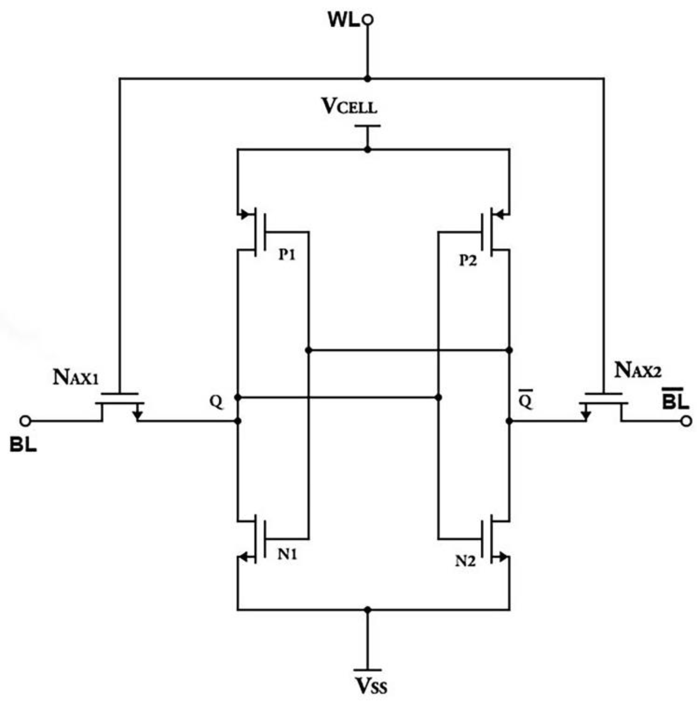

# Assignment 2

1. Explain the construction & operation of sense amplifier in SRAM?
#### **Construction**

* The **sense amplifier** is a **cross-coupled CMOS latch** made of two inverters connected back-to-back.
* The sense amplifier **detects and amplifies tiny voltage differences** between BL and BL̅ during a read.
* It acts as a **differential amplifier**, ensuring **fast and reliable read operations** in SRAM.

* It has two inputs: **Bit Line (BL)** and **Bit Line Bar (BL̅)**.
* Controlled by a **Read Enable (RE)** signal.
* Transistors used:

  * **PMOS (P1-P2)** at the top (for pull-up)
  * **NMOS (N1-N2)** at the bottom (for pull-down and enabling read)
* The circuit is **symmetrical** - one side processes BL, the other BL̅.

#### **Operation**

1. **Precharge Phase (RE = 0):**

   * Both BL and BL̅ are precharged to **VDD/2** (mid-level voltage).
   * P1 and P2 ON → pass bit-line voltages to internal nodes **X** and **Y**.
   * N2 OFF → amplifier inactive.

2. **Read Phase (RE = 1):**

   * P1 & P2 OFF; N2 ON → circuit activated.
   * Small voltage difference appears:

     * Example: BL = 1.6 V, BL̅ = 1.8 V.
   * These are both logic ‘1’, but BL̅ is slightly higher → N1 (driven by BL̅) conducts more strongly.

3. **Amplification:**

   * Because N1 pulls its node (Y) down faster, the cross-coupled structure **amplifies** the small ΔV.
   * Quickly forces one node to **0 V** and the other to **VDD**, producing a clear logic 0 or 1.

4. **Output:**

   * The difference between BL and BL̅ is **converted to a full digital signal** (strong ‘0’ or ‘1’).
   * The sensed data is then passed to the output buffer.

---

2. The following memories are specified by the number of words times the number of bits per word. How many address lines and input/output data lines are needed in each case?
* 48K × 8
    * Number of words = 48K = 48 × 1024 = 49,152
    * A = log₂(49,152) ≈ 16
    * D = 8
* 512K × 32
    * Number of words = 512K = 512 × 1024 = 524,288 = 2¹⁹
    * A = 19
    * D = 32
* 64M × 64
    * Number of words = 64M = 64 × 2²⁰ = 2²⁶
    * A = 26
    * D = 64
* 2G × 1
    * Number of words = 2G = 2 × 2³⁰ = 2³¹
    * A = 31
    * D = 1

---

3. A 64K × 16 RAM chip uses coincident decoding by splitting the internal decoder into row select and column select. Assuming that the RAM cell array is square, what is the size of each decoder, and how many AND gates are required for decoding an address?

total address lines

    64K = 64 × 1024 = 65536 = 2¹⁶

    So, K = 16 address lines.

Split decoder
For **square array**,
$$
\frac{K}{2} = \frac{16}{2} = 8
$$

* Row decoder → **8 input → 2⁸ = 256 outputs**
* Column decoder → **8 input → 2⁸ = 256 outputs**

**Number of AND gates**: Each 8-input decoder requires **2⁸ = 256 AND gates**.
Since there are two decoders:
$$
\text{Total AND gates} = 256 + 256 = 512
$$

