## **Memory Overview**

### **Definition**

* Memory = collection of **binary storage cells** + control circuits.
* **RAM** → temporary (volatile).
* **ROM** → permanent (non-volatile).

---

### **Organization**

* Arranged as an **array of words** (each has an **address**).
* Uses **decoders** and **chip select** logic.
* Designed for required **capacity** & **speed**.

---

### **Performance**

* **Access Time:** time to read/write data.
* **Cycle Time:** minimum delay between two accesses.
* **Example**:

    CPU clock = 50 MHz → 20 ns/cycle

    Memory access time = 65 ns

    Write cycle time = 75 ns 

    Memory is slower than CPU → So the CPU must wait for:
$$
65\,\text{ns} / 20\,\text{ns} = 3.25 \approx 4\ \text{clock cycles} \ (\text{for read})
$$
$$
75\,\text{ns} / 20\,\text{ns} = 3.75 \approx 4\ \text{clock cycles} \ (\text{for write})
$$

* for read operation:
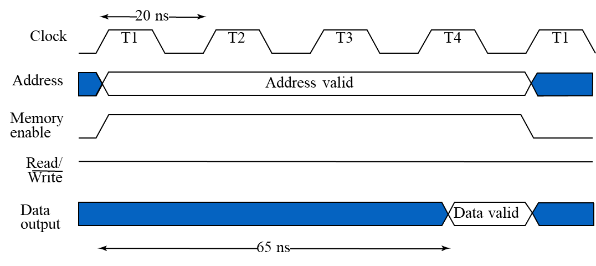

* for write operation:
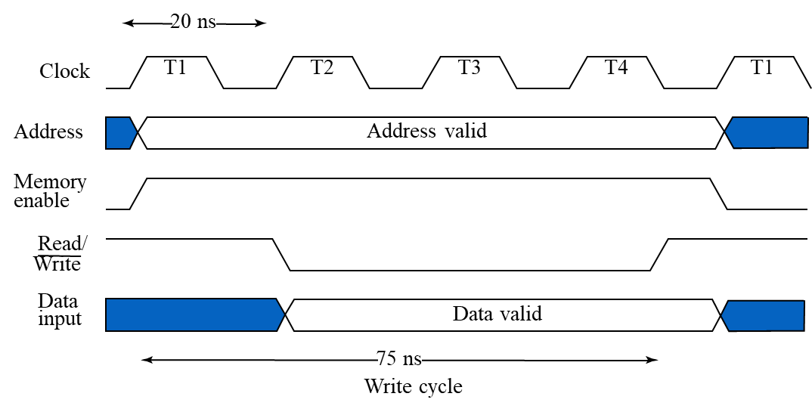

### **RAM**

* Stores data in **words** (groups of bits).
* **1 byte = 8 bits**.
* Communication via **data**, **address**, and **control lines**.
* **Examples**
    * **1K × 16 RAM:** k = 10, n = 16.
    * **2M × 16 RAM:** k = 21, n = 16.
    * **k = 24, n = 64:** → 128 MB memory.

### **Operations**

* Needs **data**, **address**, and **control (R/W)** signals.
* **Read:** Apply address → Activate *Read*.
* **Write:** Apply address & data → Activate *Write*.

## Static RAM (SRAM)
* **Basic Element:** Each cell uses an **SR latch** for data storage.
* **Control Signal:** **Select** determines whether the cell holds or updates data.

||||
|-|-|-|
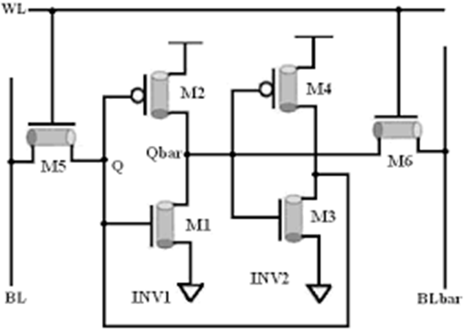|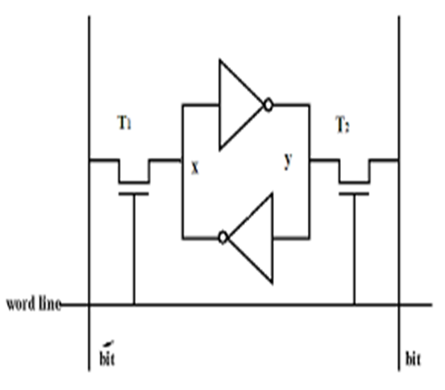
|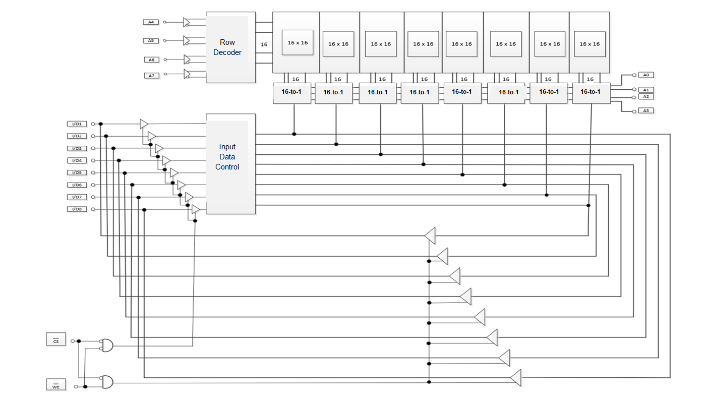|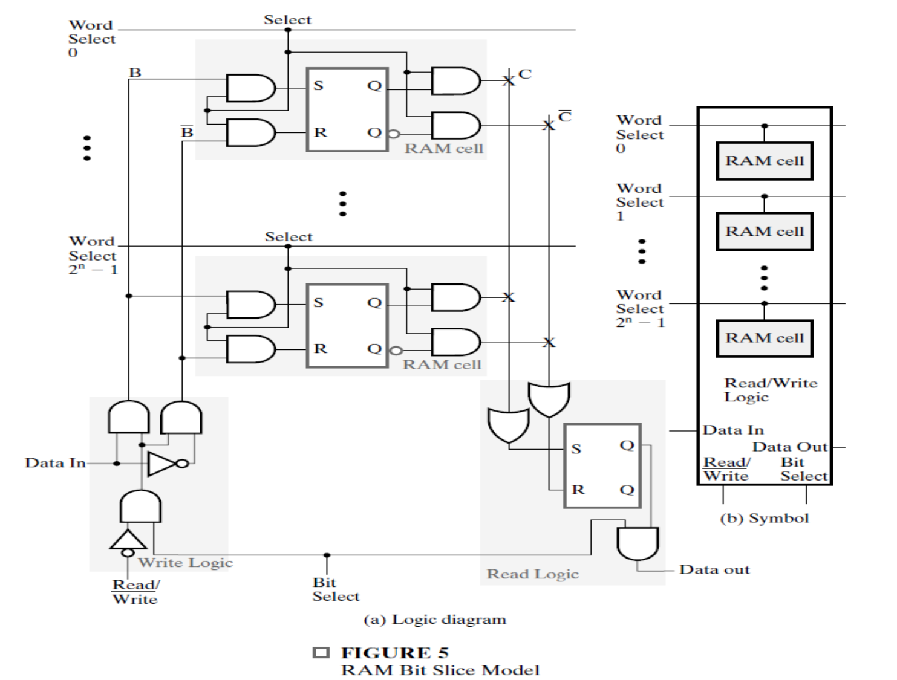|

#### **Operation:**

* **Storage element:** SR-latch (holds one bit).
* **Select input (cell select):**

  * **Select = 0:** latch holds its current content; outputs gated → **C = 0, C̅ = 0** (outputs disabled).
  * **Select = 1:** latch inputs enabled; latch is loaded from **B** and **B̅**; outputs reflect stored value (**C = stored bit, C̅ = complement**).
* **Write path:** B / B̅ drive S and R when Select = 1 → write new bit.
* **Read path:** When Select = 1 the gated outputs present the stored bit on the bit-line (or sense amplifier).

#### RAM bit-slice (collection of cells for one bit position)

* Contains many cell latches (one per word) sharing:

  * **Word-select lines** (one hot per word) to choose which cell in the slice is active.
  * **Write logic** producing B / B̅ for the selected cell.
  * **Read gating** to place the selected cell’s output onto the slice output line.

* **Behavior:**

  * **Word-Select = 0:** every cell’s S and R = 0 → no change.
  * **Word-Select = 1 (for one word only):** selected cell loads B/B̅ on write; on read its stored value is driven to the slice output.

### Building a RAM IC from slices

* **Decoder:** k address lines → **2^k word-select lines** (one line asserted to select a single word).
* **Tri-state buffers** on slice outputs: allow many slices (one per bit of the word) to **share a common data bus** and be combined into an n-bit wide memory.
* **Capacity formula:** with k address lines and n bit-slices → memory size = **2^k × n bits (or 2^k × (n/8) bytes)**.

### Typical read / write sequences (high level)

* **Read:** apply address → decoder asserts the corresponding Word-Select → selected cell’s outputs enabled → tri-state buffers drive the n-bit data bus → CPU reads data.
* **Write:** apply address and write data on bus → decoder asserts Word-Select → write logic drives B/B̅ into the selected cell latch → latch stores new bit.

### Key implementation notes (concise)

* Tri-state outputs are essential so multiple ICs can share a common bus without contention.
* Decoder must be one-hot (only one Word-Select active) to prevent multiple latches driving the same bit line.
* Real SRAM uses sense amps and stronger bus protocols, but the latch+select model captures the basic logical behavior.

Here’s a **clear and compact summary** of that RAM IC and SRAM design section, formatted for notes or reports:

## **RAM Design Methods**

### **1. Straightforward Design**

* Uses **one k-input decoder** with **2ᵏ outputs**, requiring 2ᵏ AND gates (each with k inputs).
* If many cells share the same read/write circuitry, the **access time** and **write cycle time** increase due to large fan-out and capacitance.
* Suitable for **small memory arrays** only.

### **2. Coincident Selection Design**

Used for **large memories** to reduce decoder complexity and fan-out.

#### **Concept:**

* The memory array is arranged as a **2D grid** (rows × columns).
* **Two smaller decoders** are used:

  * **Row Decoder:** selects word line (vertical).
  * **Column Decoder:** selects bit line (horizontal).
* Each is a **k/2-input decoder**, instead of one k-input decoder.
* Reduces total gates and propagation delay.

#### **Procedure:**

1. Find total **address lines (K)**.
2. Compute the square root of total memory bits to make the array approximately **square**.
3. Split address lines:

   * **Row Decoder:** uses **MSB (K/2)** bits.
   * **Column Decoder:** uses **LSB (K/2)** bits.

  **Example 1: $16 \times 1$ RAM using a $4 \times 4$ Cell Array**
  - Memory has $16$ locations $\rightarrow K = 4$ address lines.
  - $\sqrt{16} = 4 = 2^2$, so $K/2 = 2$.
  - **Row Decoder:** uses $2$ MSBs.
  - **Column Decoder:** uses $2$ LSBs.
  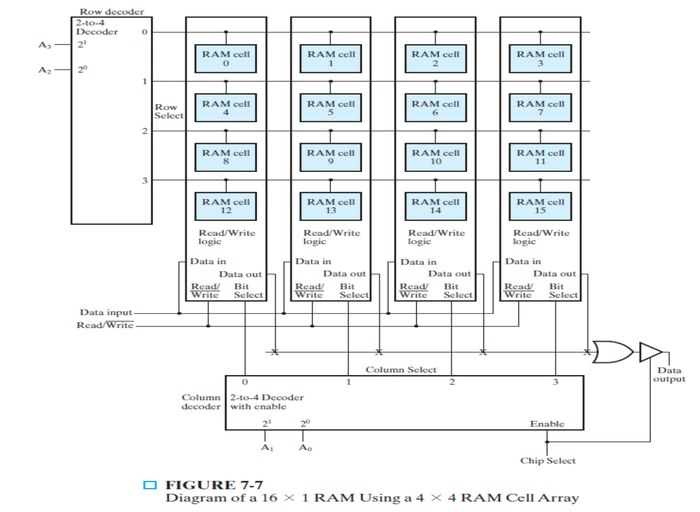

  **Example 2: $32\text{K} \times 8$ RAM using Coincident Selection**
  - Memory size: $32\text{K} = 2^{15}$ locations $\rightarrow K = 15$ address lines.
  - Total bits: $2^{15} \times 8$.
  - $\sqrt{2^{15} \times 8} = 2^9$, so $K/2 = 9$.
  - **Row Decoder:** uses $9$ MSBs.
  - **Column Decoder:** uses remaining $6$ LSBs ($15 - 9 = 6$).
  - Each column output selects $8$ bits to maintain word width.
  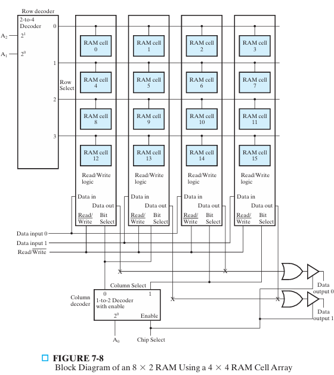

### **Advantages of Coincident Selection**

* Reduces **decoder size** and **fan-out**.
* Improves **speed** and **scalability** for large memory arrays.
* Keeps physical memory more compact and regular.

Here’s a **clear, compact, and formatted version** of your notes on **Array of SRAM ICs**, styled to match your earlier sections:

## **Array of SRAM ICs**

### **Concept**

* **Total capacity** of a memory = (Number of words) × (Bits per word).
* Increasing either factor changes different aspects of the design:

  * **More words** → Requires **more address lines** (each new bit doubles memory size).
  * **More bits per word** → Requires **more data I/O lines** (address lines stay the same).

### **Construction Procedure**

To build a memory of **2ᵏ¹ × n₁** using chips of **2ᵏ² × n₂**, follow these steps:

1. **Number of chips per column:**
   $$
   = \frac{2^{k_1}}{2^{k_2}} = 2^{(k_1 - k_2)}
   $$
   Add a **decoder** with **(k₁ − k₂)** input lines to generate **Chip Select (CS)** signals.

2. **Number of columns (for bit width):**
   $$
   = \frac{n_1}{n_2}
   $$
   Connect chips in **parallel** for wider data words.

### **Example**

**Construct a 256K × 8 RAM using 64K × 8 RAM chips**

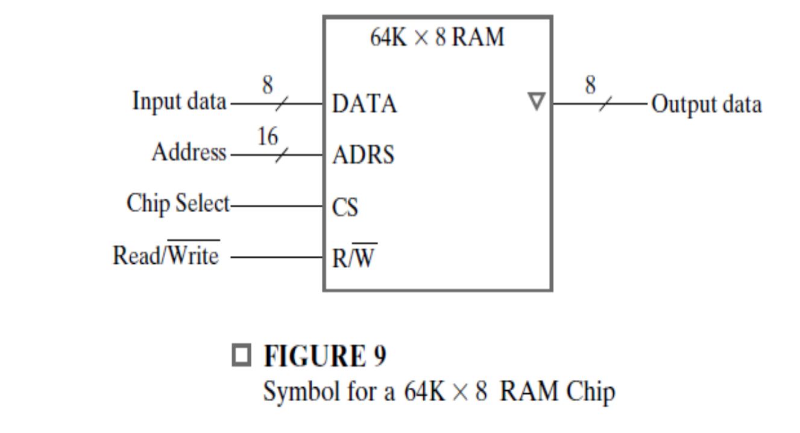

**Calculations:**

Given:  
- $k_1 = 18$, $n_1 = 8$  
- $k_2 = 16$, $n_2 = 8$

1. **Number of chips per column:**  
  $$
  \frac{2^{18}}{2^{16}} = 2^{2} = \textbf{4 chips}
  $$
  (A 2-to-4 decoder is needed for chip selection.)

2. **Number of columns (for bit width):**  
  $$
  \frac{8}{8} = \textbf{1 column}
  $$

3. **Decoder required:**  
  **2-to-4 decoder** (selects one of the 4 chips).

To construct a $256\text{K} \times 8$ RAM from $64\text{K} \times 8$ chips, connect 4 chips in parallel (vertically) using a 2-to-4 decoder for chip select. Only one column is needed since the bit width matches.

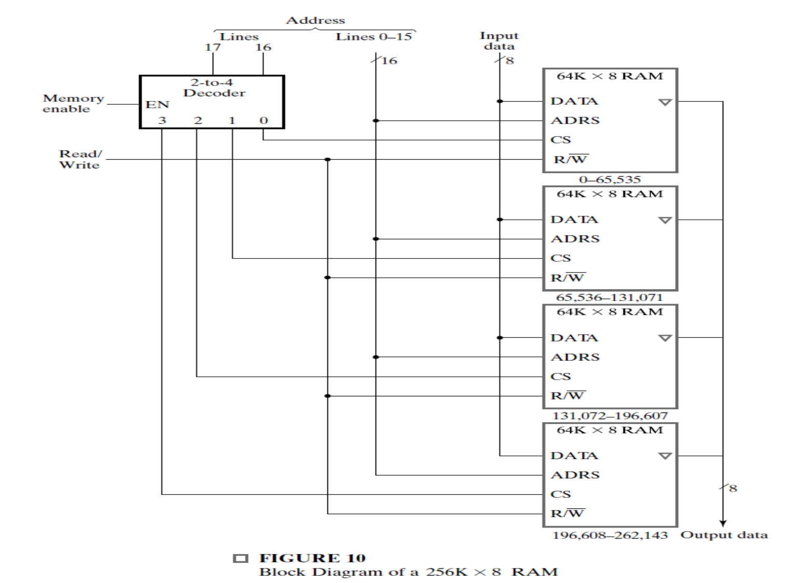

### **Example**

**Construct a 64K × 16 RAM using 64K × 8 RAM chips**

Given:  
- $k_1 = k_2 = 16$, $n_1 = 16$, $n_2 = 8$

1. **Chips per column:**  
   $$
   2^{16-16} = 2^0 = \textbf{1 chip}
   $$

2. **Columns (for bit width):**  
   $$
   \frac{16}{8} = \textbf{2 columns}
   $$

3. **Total chips needed:** **2 chips in parallel** (no decoder needed).

4. **Connection:** Address and control lines are common; data lines split (D0-D7, D8-D15).

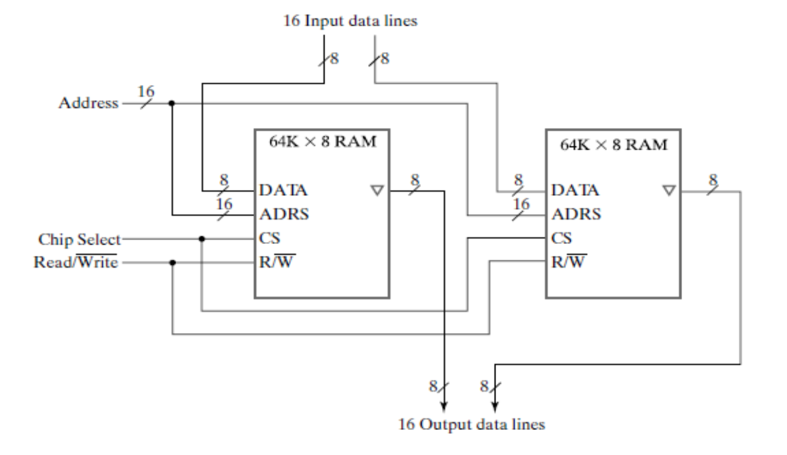

# Assignment
1. Explain the construction & operation of sense amplifier in SRAM?
2. The following memories are specified by the number of words times the number of bits per word. How many address lines and input–output data lines are needed in each case?
* 48K × 8
* 512K × 32
* 64M × 64
* 2G × 1
3. A 64K × 16 RAM chip uses coincident decoding by splitting the internal decoder into row select and column select. Assuming that the RAM cell array is square, what is the size of each decoder, and how many AND gates are required for decoding an address?

# Sheet
1. Using the 64K × 8 RAM chip plus a decoder, construct the block diagram for a 512K × 16 RAM.

2. **(a)** How many 128K × 16 RAM chips are needed to provide a memory capacity of 2 MB = 1 M × 16 RAM?  
   **(b)** How many address lines are required to access 2 MB? How many of these lines are connected to the address inputs of all chips?
      
