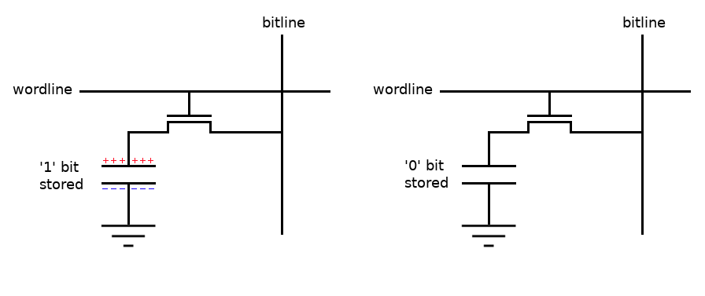
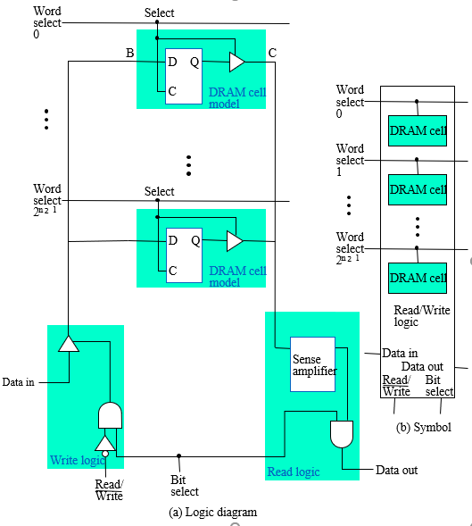
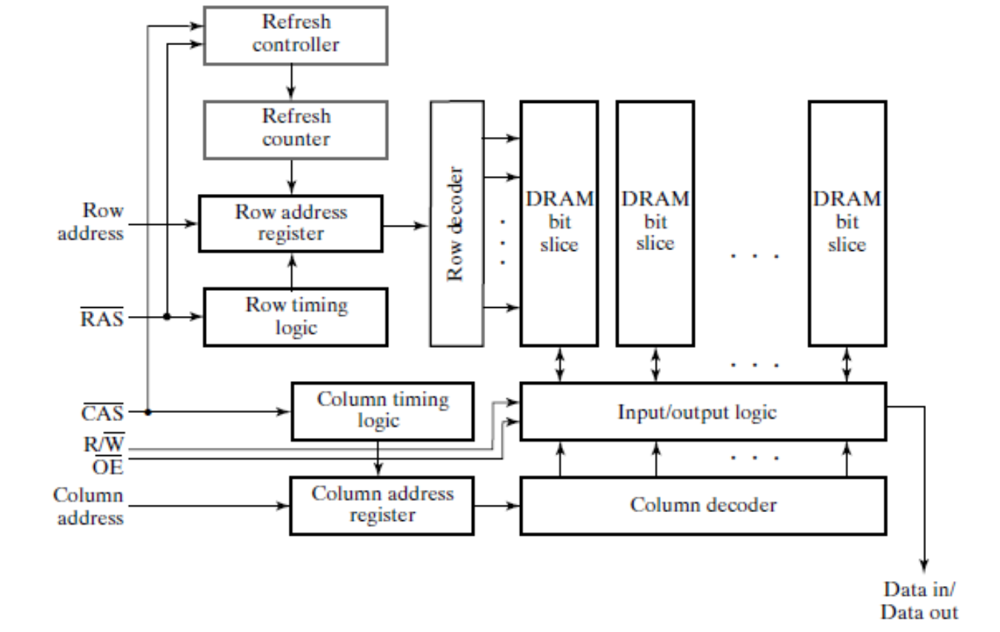
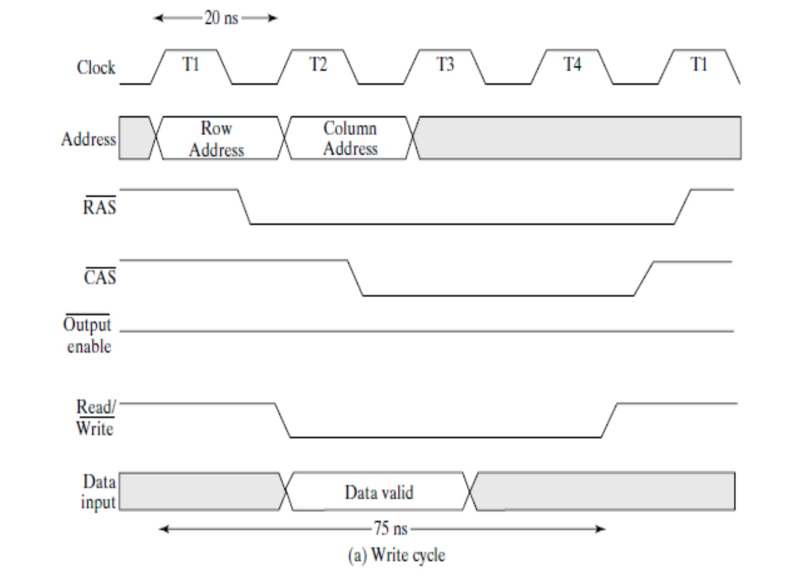
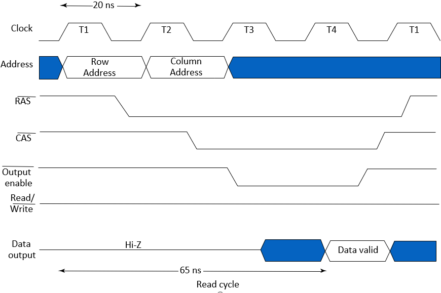

# Dynamic RAM (DRAM) Overview

DRAM provides high storage capacity at low cost, dominating applications like primary computer RAM. Unlike SRAM, DRAM storage is temporary and requires periodic refresh to prevent data loss due to charge leakage.

## DRAM Cell
- Consists of a capacitor (C or Cs) for charge storage and a transistor (T) as a switch.
- Logical '1': Sufficient charge on capacitor (Vc > VDD/2).
- Logical '0': Insufficient charge (Vc ≤ VDD/2).
- Transistor operation:
  - Open (wordline low): Isolates capacitor, storing charge (leaks over time).
  - Closed (wordline high): Allows charge flow to/from bitline (B or BL) for read/write.
- Bitline precharged to VDD/2 to minimize time/power during charge sharing.
- Sense amplifier detects/amplifies bitline voltage changes for readout.

## Destructive vs. Non-Destructive Readout
### Destructive Readout
- Alters memory contents during read (e.g., in DRAM due to charge sharing).
- Requires immediate rewrite/restore to preserve data.

### Non-Destructive Readout
- Does not alter contents during read.
- Example: Flip-flop (e.g., in SRAM).
  - Sensing output voltage retains state and data.

## Dynamic RAM  Bit Slice Model
|||
|-|-|
||The bit slice model in DRAM represents a vertical cross-section of the memory array for a single bit position across multiple rows.|

* **DRAM Cell Array**

  * Composed of multiple 1T1C cells (one transistor, one capacitor) stacked in a column.
  * Cells share a common **bitline (B)**.
  * Each cell's transistor is controlled by a **wordline** (row select).
  * The **capacitor (C)** stores the bit as electric charge.

* **Tri-State Drivers**

  * Drive the capacitor during **write** or **precharge** operations.
  * Can output **high (VDD)**, **low (0V)**, or **high-impedance (Z-state, disconnected)**.
  * Allows selective driving of the bitline without conflict.
  * Enables efficient **charge transfer** to/from the cell while minimizing power.

* **Sense Amplifier**

  * Measures small voltage changes (10–100 mV) on the bitline after charge sharing.
  * Bitline is precharged to **VDD/2**; a stored ‘1’ raises voltage slightly, a ‘0’ lowers it.
  * Amplifies the differential to **full logic levels**.

* **Rewrite After Reading**

  * Reads are **destructive** due to charge sharing, depleting the cell capacitor.
  * Sense amplifier automatically **restores the original value** before the wordline deactivates.

* **Array of Sense Amplifiers (Row Buffer)**

  * Each bitline/column has a sense amplifier acting as **temporary storage**.
  * When a row is activated (**RAS**), all row data is **latched into the row buffer**.
  * Subsequent column accesses (**CAS**) read/write from/to the buffer quickly.
  * Acts like a **cache**, reducing latency for column bursts.
  * Requires **precharge (closing the row)** before accessing another row.

To reduce pins, addresses are multiplexed into row and column halves.

- **Row Address**: Selects row first.
- **Column Address**: Selects word from the row's data.
- Addresses latched in registers for cycle duration.

### Control Signals
- **RAS̄ (Row Address Strobe)**: Loads row address (active low: 1 → 0).
- **CAS̄ (Column Address Strobe)**: Loads column address (active low: 1 → 0).
- **R/W̄ (Read/Write)**: 0 for write, 1 for read.
- **OĒ (Output Enable)**: Enables output during read (active low).
- Signals active at low (0) level.

### Row Address Handling
1. Apply row address to inputs.
2. RAS̄: 1 → 0 → Loads register, decodes, selects row of cells.

### Column Address Handling
1. Apply column address.
2. CAS̄: 1 → 0 → Loads register, decodes, selects columns (size = data bits).

### Write Operation

- R/W̄ = 0.
- Apply input data (timed with column address).
- Data → selected bitlines → overwrites cells in selected row.
- Other row cells restored.
- Cycle ends: CAS̄/RAS̄ → 1; new data stored.

### Read Operation

- R/W̄ = 1.
- Row data → bitlines → sensed by amplifiers.
- Column address selects output data.
- OĒ enables output.
- All row values restored (destructive read handling).
- No input data; similar timing to write.
