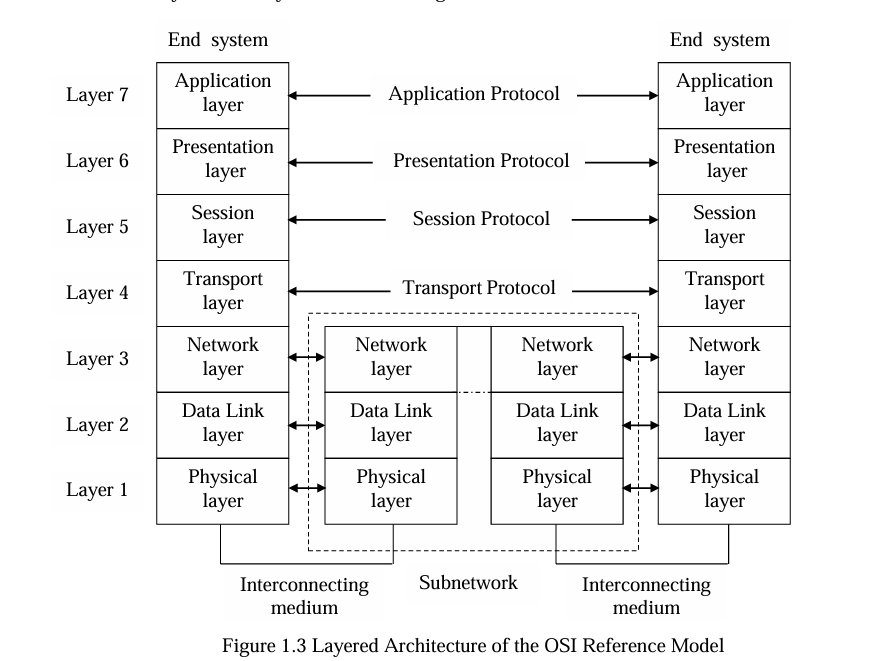
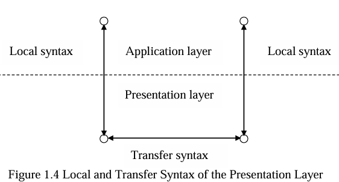
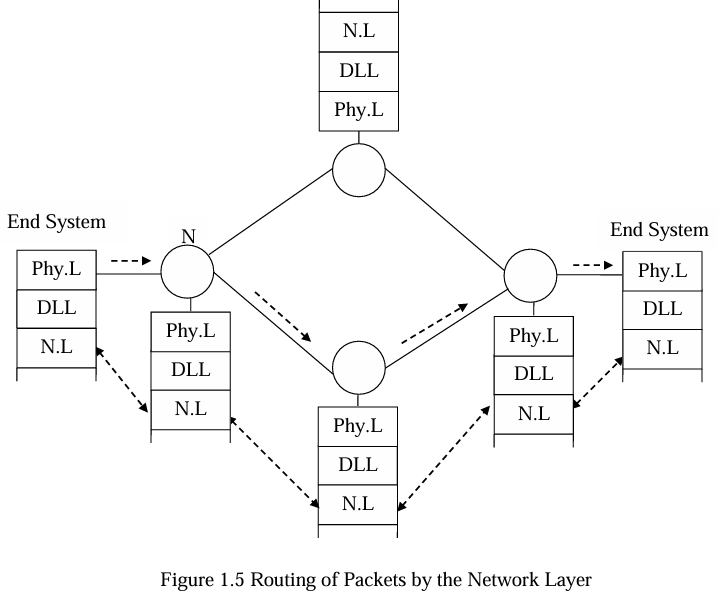

# Network Architecture 
Communication is the exchange of information between entities.
In computer networks, this process is modeled using the layered architecture, mainly represented by the OSI Reference Model.

### 1.1 Topolgy

* **End System**: Independent processing unit (e.g., computers, terminals, software).
    * Connects to the network via a unique address.
    * Contains application entities for communication.
* **Subnetwork**: Handles data transfer only.
    * Composed of routing nodes and transmission media (electrical/optical).

### 1.2 Elements of Meaningful communication
* **Common Theme**: Both communicating entities must share a common subject or purpose.
* **Common languague**: They must use the same language or protocol to understand each other’s messages.
* **Orderly Session**: Communication should follow a disciplined and controlled exchange, ensuring:
   * *Flow control*: messages are sent at a manageable rate.
   * *Error control*: errors are detected and corrected.
   * *Synchronization*: proper timing and sequence of communication are maintained.

### 1.3 Transport * Oriented Functions
the subnetwork handles the basic transport of messages, but additional functions are needed in the end systems to ensure reliable and error-free delivery.

* **1.3.1 Interaction with the Subnetwork** :
End systems must interact with the subnetwork to send and receive data.
    * This involves:
        * Specifying destination addresses
        * Answering incoming connections
        * Releasing connections after communication
    * Some subnetworks act like a postal service, where the message (with source and destination addresses) is simply handed over for delivery.

* **1.3.2 Quality of Transport Service**:
End systems must ensure the desired Quality of Service for a connection.
    * QoS parameters include:
       * Error rate
       * Message delay (latency)
       * Throughput (data rate)
       * Cost of communication

* **1.3.3 Conversion of Signals**:
Messages in computers are digital (bits).

    * End systems convert these bits into electrical signals (with suitable voltage levels) to be transmitted over the network medium.

* **1.3.4 Error Control**:
Communication can suffer from noise and distortion, causing errors.
    * End systems must use error detection and correction mechanisms to ensure accurate message delivery.

### 1.4 Components of a Computer Network
Essential functions within each end system:
* Authentication and login
* Common syntax
* Orderly message exchange
* Transport connection & flow control
* Subnetwork interaction
* Error control
* Signal conversion
* **Implemented by**:
    * Hardware (devices, cables, NICs)
    * Software (protocols, OS, applications)

### 1.5 Archtecture of a Computer Network
* Describes how network components are **organized and connected**. 
* Defines **specifications, rules, and relationships** among components.
* Ensures **proper interaction** between physical and logical parts.
* Based on a **layered architecture** for structured communication.
* Communication is divided into **hierarchical functional layers**.
* Network consists of **end systems** (send/receive data) and a **subnetwork** (transfers data).

### 1.6 Need of Standardization of Network Architecture
* Enables transition from *closed* to *open systems*.
* Ensures interoperability between different architectures.
* Reduces interface development effort.
* Standerdized architectures include:
    * IBM's SNA (System Network Architecture)
    * Digital's DNA (Digital Netrwok Architecture)
    * OSI Reference Model by ISO and ITU-T
    * Internet Architecture

### 1.7 Open System Interconnection
* Universal model for communication between systems.
* Promotes openness using public standard protocols.
* Defines a **layered architecture** for structured communication.
* Acts as a **reference model**, not a specific implementation.

### 1.8 Layered Architecture of the OSI Reference Model

#### 1.8.1 Application Layer
* **Role**: **Interface** between user **applications** and the **OSI network**.
* **Purpose**: Allows application programs to **access network services** and communicate over the network.
* **Services Provided**:
    * Identify communication partners (by name or address)
    * Establish authority to communicate
    * Set privacy/encryption agreements
    * Authenticate communication partners
    * Define responsibility for error recovery
* **Examples**:
    * Web Browsers → Use HTTP to access the World Wide Web (WWW)
    * File Transfer → Uses FTP (File Transfer Protocol)
    * Electronic Mail → Uses SMTP (Simple Mail Transfer Protocol)
    * Remote Terminal Access → Uses Telnet to connect to remote computers

#### 1.8.2 Presentation Layer

* **Purpose**: Ensures data is presented in a usable and meaningful way between applications.
* **Main Functions**:
    * Resolves syntax differences (data formats, codes) between sender and receiver.
    * Manages **three** syntaxes:
        * Sender’s syntax
        * Receiver’s syntax
        * Transfer syntax (negotiated for transmission)
    * Performs **data translation**, **format conversion**, and **encryption/decryption** if needed.
* **Maintains data integrity and meaning** across different systems.

#### 1.8.3 Session Layer
* **Purpose**: Manages and contrils dialogues between applictions.
* Main Functions:
    * **Session Organization**: Establishes, maintains, and terminates sessions.
    * **Dialogue Synchronization**: Adds checkpoints to recover data in case of failure.
    * **Interaction Management**: Controls data flow supports full duplex or half duplex communication.
* Ensures smooth and reliable **data exchange coordination** between communicationg systems.

#### 1.8.4 Transport Layer
* **Purpose**: Ensures data is deliverd correctly, in sequence, and efficiently between source and destination.
* Main Functions: 
    * Accepts data from the **Session Layer**.
    * **Split** data into smaller units (segments) if necessary.
    * Passes data to the **Netwok Layer**.
    * Ensures all pieces arrive **error-free** and **in order**.
* Connection Managment:
    * **Connection-Orinted Service**: Reliable, error-free, ordered delivery (e.g., TCP).
    * **Connectionless Service**: No guarantee of delivery order or reliability (e.g., UDP).
* **Flow Control**: Prevents a fast sender from overwhelming a slow receiver.
* **Efficiency**: May use **multiplexing** or **multiple network connections** to optimize performance.
* **Scope**: True **end-to-end** communication between source and destination applications.

### 1.8.5 Network Layer

* **Role**: Handles **routing and delivery** of data packets across interconnected networks.
* **Purpose**: Enables communication between devices on **different networks**, hiding the detalis of underlying transmission technologies from higher layers.
* **Main Functions**:
    * **Routing**: Determines the best path for data to reach the destination.
    * **Addressing**: Identifies devices using logical addresses (e.g., IP addresses).
    * **Inter-networking**: Connects and manages communication between heterogeneous networks.
    * **Packet Forwarding**: Moves packets through multiple nodes (routers) to reach the target system.
    * Congestion Control: Manages network traffic to prevent overload.
* **Communication Scope**:
    * Between end systems and network access nodes.
    * Between network nodes (routers) using layers 1–3.
* **Examples of Protocols**:
    * IP (Internet Protocol)
    * ICMP (Internet Control Message Protocol)
    * OSPF (Open Shortest Path First)

### 1.8.6 Data Link Layer
* **Role**: Provides reliable **frame-level communication** over the physical link.
* **Purpose**: Converts raw bit streams from the physical layer into error-free frames for the network layer.
* **Main Functions**:
    * **Framing**: Divides data from the network layer into manageable ***frames*** for transmission.
    * **Error Detection & Correction**: Ensures that data is delivered accurately using checksums or CRC.
    * **Flow Control**: Regulates data flow between sender and receiver to **prevent congestion**.
    * **Medium Access Control (MAC)**: Determines which device can use the shared medium in LANs.
* **Communication Scope**:
    * Between *directly connected nodes* (e.g., switches, routers).
* **Examples of Protocols**:
    * Ethernet (IEEE 802.3)
    * PPP (Point-to-Point Protocol)
    * HDLC (High-Level Data Link Control)

### 1.8.7 Physical Layer
* **Role**: Responsible for the actual transmission of **raw bits** over the physical communication medium.
* **Purpose**: Defines the electrical, mechanical, and procedural characteristics of the network interface.
* **Main Functions**:
    * **Bit Transmission**: Sends and receives raw bits (0s and 1s) over cables or wireless channels.
    * **Signal Conversion**: Converts bits into electrical, optical, or radio signals for transmission.
    * **Signal Encoding**: Applies encoding schemes if required (e.g., Manchester, NRZ).
    * **Hardware Interface**: Defines connector types, pin assignments, voltage levels, and data rates.
    * **Signal Relaying**: Uses intermediary devices like modems and repeaters for signal boosting and transmission.
* **Examples of Technologies**:
    * Ethernet cables, fiber optics, Wi-Fi, Bluetooth, DSL.